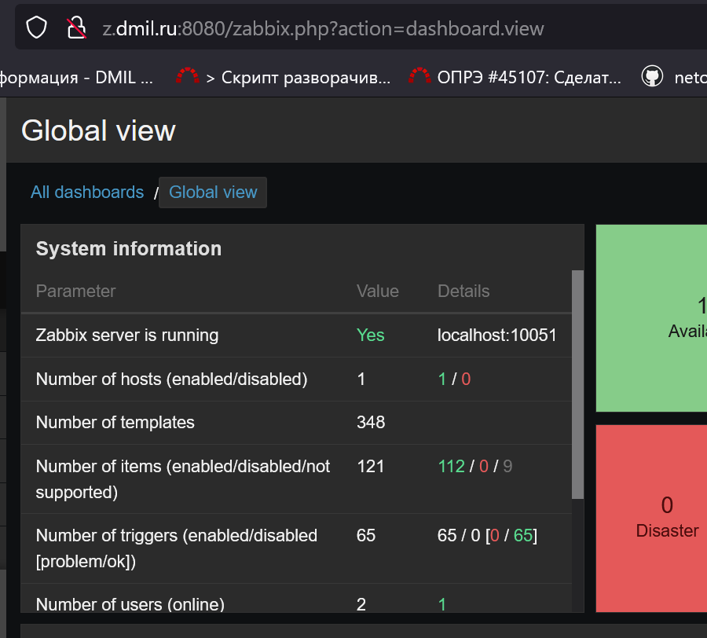

# Домашнее задание к занятию "`Zabbix`" - `Илларионов Д.`

     

## Задание 1

Установите Zabbix Server с веб-интерфейсом.
Процесс выполнения

    Выполняя ДЗ, сверяйтесь с процессом отражённым в записи лекции.
    Установите PostgreSQL. Для установки достаточна та версия, что есть в системном репозитороии Debian 11.
    Пользуясь конфигуратором команд с официального сайта, составьте набор команд для установки последней версии Zabbix с поддержкой PostgreSQL и Apache.
    Выполните все необходимые команды для установки Zabbix Server и Zabbix Web Server.

#### Требования к результаты

    Прикрепите в файл README.md скриншот авторизации в админке.
    Приложите в файл README.md текст использованных команд в GitHub.

#### Решение



Установка:
```bash
apt install -y postgresql
wget https://repo.zabbix.com/zabbix/6.0/ubuntu/pool/main/z/zabbix-release/zabbix-release_6.0-4+ubuntu22.04_all.deb
dpkg -i zabbix-release_6.0-4+ubuntu22.04_all.deb
apt update
apt install zabbix-server-pgsql zabbix-frontend-php php8.1-pgsql zabbix-nginx-conf zabbix-sql-scripts zabbix-agent
systemctl status zabbix-server.service
sudo -u postgres createuser --pwprompt zabbix
sudo -u postgres createdb -O zabbix zabbix
zcat /usr/share/zabbix-sql-scripts/postgresql/server.sql.gz | sudo -u zabbix psql zabbix

```

##### Еще комментарии заметки:

Ставим Zabbix
Редактировать эту секцию
Выбираем конфигруацию на сайте zabbix

https://www.zabbix.com/download

Лучше стабильную версию lts.
Ниже генерят нам код.

a. Install Zabbix repository

```
# wget https://repo.zabbix.com/zabbix/6.0/ubuntu/pool/main/z/zabbix-release/zabbix-release_6.0-4+ubuntu22.04_all.deb
# dpkg -i zabbix-release_6.0-4+ubuntu22.04_all.deb
# apt update
```

Редактировать эту секцию
b. Install Zabbix server, frontend, agent

```
# apt install zabbix-server-pgsql zabbix-frontend-php php8.1-pgsql zabbix-nginx-conf zabbix-sql-scripts zabbix-agent
```

Можно проверить:

```systemctl status zabbix-server.service```
○ zabbix-server.service - Zabbix Server
     Loaded: loaded (/lib/systemd/system/zabbix-server.service; disabled; vendor preset: enabled)
     Active: inactive (dead)

- Служба еще не запущена.
Редактировать эту секцию
c. Create initial database

Make sure you have database server up and running.

Run the following on your database host.

```# sudo -u postgres createuser --pwprompt zabbix
# sudo -u postgres createdb -O zabbix zabbix```

Альтернатива:

su - postgres -c 'psql --command "CREATE USER zabbix WITH PASSWORD '\'12345\'';"'
su - postgres -c 'psql --command "CREATE DATABASE zabbix OWNER zabbix;"'

Если нужно изменить пароль можно так:

su - postgres -c 'psql --command "ALTER USER zabbix WITH PASSWORD '\'12345\'';"'

On Zabbix server host import initial schema and data. You will be prompted to enter your newly created password.

```# zcat /usr/share/zabbix-sql-scripts/postgresql/server.sql.gz | sudo -u zabbix psql zabbix```

Редактировать эту секцию
d. Configure the database for Zabbix server

Edit file /etc/zabbix/zabbix_server.conf

DBPassword=password

Конфиги можно найти поиском:

find / -name zabbix_server.conf
/etc/zabbix/zabbix_server.conf
find / -name zabbix_agent.conf

или можно Sed использовать.
Редактировать эту секцию
e. Configure PHP for Zabbix frontend

Edit file /etc/zabbix/nginx.conf uncomment and set 'listen' and 'server_name' directives.

# listen 8080;
# server_name example.com;

Редактировать эту секцию
f. Start Zabbix server and agent processes

Start Zabbix server and agent processes and make it start at system boot.

```# systemctl restart zabbix-server zabbix-agent nginx php8.1-fpm
# systemctl enable zabbix-server zabbix-agent nginx php8.1-fpm```

Редактировать эту секцию
g. Open Zabbix UI web page

The URL for Zabbix UI when using Nginx depends on the configuration changes you should have made.
Start using Zabbix

Проверить:

```systemctl status zabbix-server.service```
● zabbix-server.service - Zabbix Server
     Loaded: loaded (/lib/systemd/system/zabbix-server.service; enabled; vendor preset: enabled)
     Active: active (running) since Tue 2023-10-17 16:07:33 UTC; 21s ago
   Main PID: 1679 (zabbix_server)
      Tasks: 1 (limit: 2219)
     Memory: 8.3M
        CPU: 31ms
     CGroup: /system.slice/zabbix-server.service
             └─1679 /usr/sbin/zabbix_server -c /etc/zabbix/zabbix_server.conf

Редактировать эту секцию
Настраиваем Web интерфейс
Редактировать эту секцию
настраиваем параметры

http://51.250.107.117:8080/

next.
Проверяем что все ок.
next
Проверяем параметры подключения.
Редактировать эту секцию
Заходим

    Admin
    zabbix

Редактировать эту секцию
##### Установить Zabbix агент

Опять сюда:
https://www.zabbix.com/download

И выбираем что только агент хотим.

```# wget https://repo.zabbix.com/zabbix/6.0/ubuntu/pool/main/z/zabbix-release/zabbix-release_6.0-4+ubuntu22.04_all.deb
# dpkg -i zabbix-release_6.0-4+ubuntu22.04_all.deb
# apt update 
# apt install zabbix-agent
# systemctl restart zabbix-agent
# systemctl enable zabbix-agent``` 

Еще я создал А запись z.dmil.ru что бы при рестарте ВМ не менять конфиг, а менять А запись.


## Задание 2

Установите Zabbix Agent на два хоста.
Процесс выполнения

    Выполняя ДЗ, сверяйтесь с процессом отражённым в записи лекции.
    Установите Zabbix Agent на 2 вирт.машины, одной из них может быть ваш Zabbix Server.
    Добавьте Zabbix Server в список разрешенных серверов ваших Zabbix Agentов.
    Добавьте Zabbix Agentов в раздел Configuration > Hosts вашего Zabbix Servera.
    Проверьте, что в разделе Latest Data начали появляться данные с добавленных агентов.

#### Требования к результаты

    Приложите в файл README.md скриншот раздела Configuration > Hosts, где видно, что агенты подключены к серверу
    Приложите в файл README.md скриншот лога zabbix agent, где видно, что он работает с сервером
    Приложите в файл README.md скриншот раздела Monitoring > Latest data для обоих хостов, где видны поступающие от агентов данные.
    Приложите в файл README.md текст использованных команд в GitHub

## Задание 3 со звёздочкой*

Установите Zabbix Agent на Windows (компьютер) и подключите его к серверу Zabbix.
Требования к результаты

    Приложите в файл README.md скриншот раздела Latest Data, где видно свободное место на диске C:

#### Критерии оценки

    Выполнено минимум 2 обязательных задания
    Прикреплены требуемые скриншоты и тексты
    Задание оформлено в шаблоне с решением и опубликовано на GitHub
